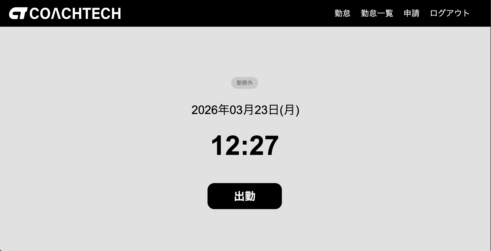
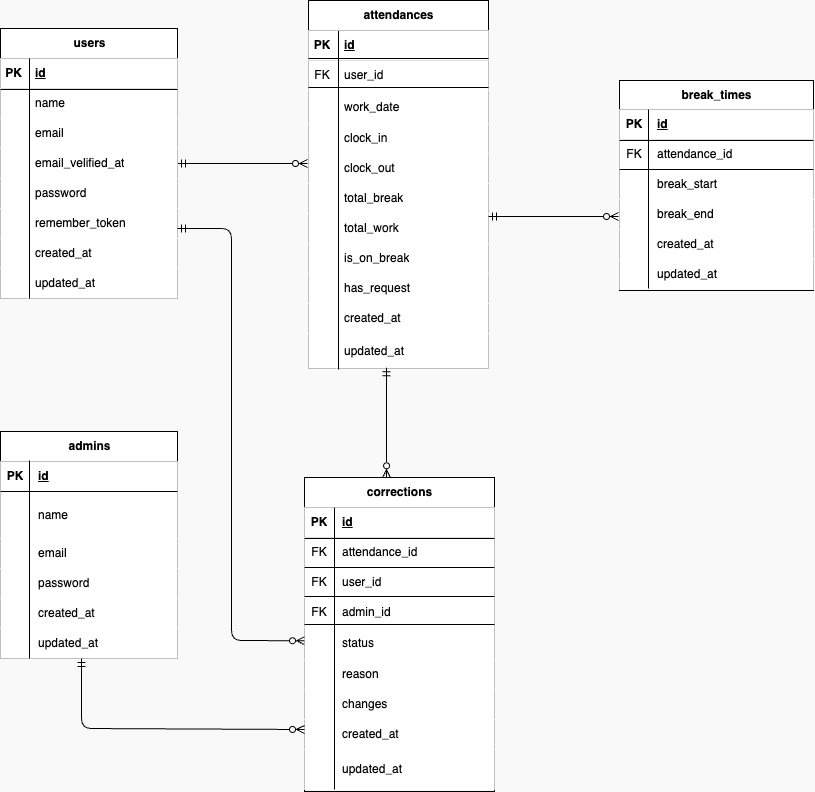

# 勤怠管理アプリ （TimeTrack）

- 事務職としての実務経験を活かし、「給与計算に直結するデータの整合性」と「要件定義への忠実な実装」を
  重視して開発した勤怠管理アプリです。

【制作の背景・目的】

1. 事務経験を活かしたデータ整合性の担保
   10年以上のオフィスワーク経験から、勤怠データの不備が給与計算の負担に直結することを実感しています。そのため、以下の実装を行いました。</br>

- 徹底したバリデーション:二重打刻の防止や、退勤時間が出勤時間より前にならないなどの入力チェックを厳格にしました。
- 整合性の維持:勤怠修正の「申請・承認フロー」を設け、いつ誰がデータを変更したか記録する設定を目指しました。

2. 要件定義への忠実な再現

- スクール課題の要件を深く読み込み、漏れや解離がないよう一つずつ確認しながら実装しました。
- 正確なコーディングルールと読みやすいディレクトリ構造を意識しています。

## 画面見本



## 主な機能

| 役割             | 機能詳細                                                 |
| :--------------- | :------------------------------------------------------- |
| **管理者**       | スタッフ管理、月次一覧取得、CSV出力、修正申請の承認/却下 |
| **一般ユーザー** | 出退勤打刻、勤怠一覧・詳細閲覧、勤怠修正申請             |

## ER 図



---

## 使用技術（実行環境）

- Backend: PHP 8.4 / Laravel 10
- DB: MySQL 8.0
- Infrastructure: Docker (Nginx, PHP-fpm, MySQL, MailHog)
- Tool: GitHub / phpMyAdmin

## セットアップ(Docker環境)

- リポジトリをクローンした後、以下の手順で構築してください。

### 1. 環境構築・コンテナ起動

```bash
git clone git@github.com:okumurachie/TimeTrack.git
cd TimeTrack
docker-compose up -d --build
```

### 2. アプリ設定（コンテナ内）

```bash
docker-compose exec php bash
composer install
cp .env.example .env  # 起動後 .env内のDB・Mail設定を下記参照し変更
php artisan key:generate
php artisan migrate --seed
```

### 3. .env設定値

```env
DB_HOST=mysql
DB_DATABASE=laravel_db
DB_USERNAME=laravel_user
DB_PASSWORD=laravel_pass

MAIL_HOST=mailhog
MAIL_PORT=1025
```

## ログイン情報

### テスト用アカウント

| 権限   | メールアドレス     | パスワード  | 備考      |
| :----- | :----------------- | :---------- | :-------- |
| 管理者 | `admin1@test.com`  | `admin1234` | 管理者1   |
| 一般   | `reina.n@test.com` | `abcd1234`  | 西 伶奈   |
| 一般   | `taro.y@test.com`  | `abcd5678`  | 山田 太郎 |

## URL

- 勤怠登録画面:http://localhost/attendance
- 会員登録：http://localhost/register
- 一般ユーザーログイン:http://localhost/login
- 管理者ログイン:http://localhost/admin/login

## 勤怠記録情報のダミーデータについて

- 正確な挙動確認ができるよう、テスト用のシードデーターを調整しています。
